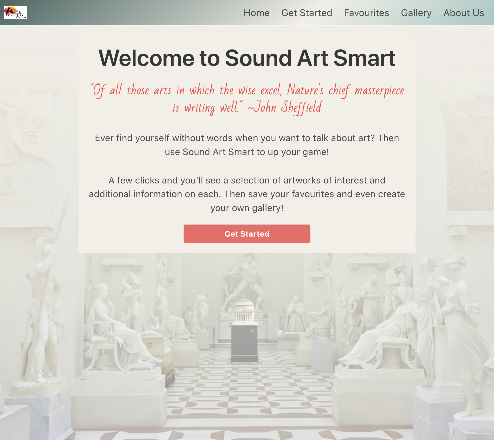
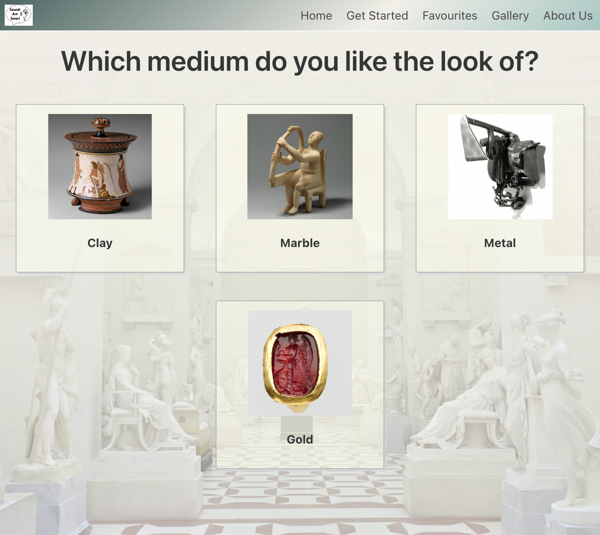
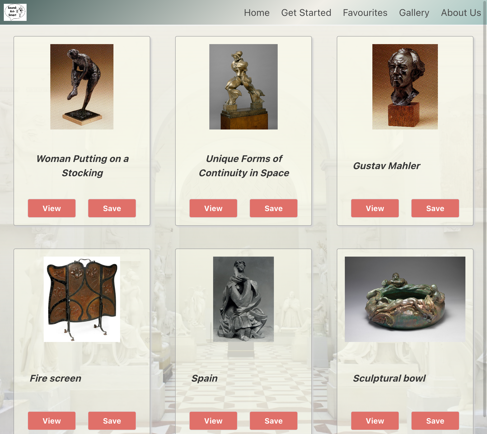
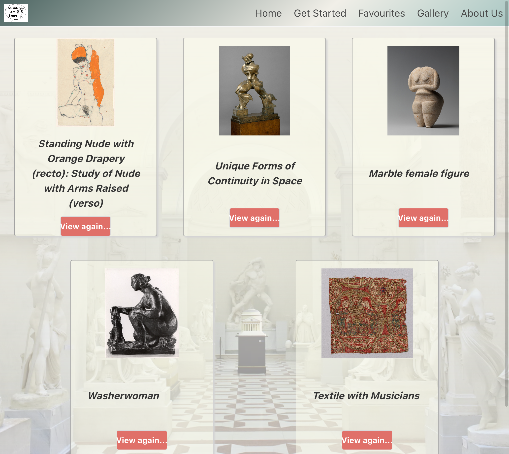
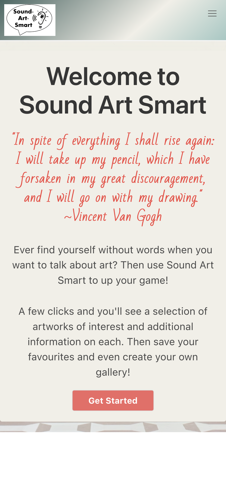
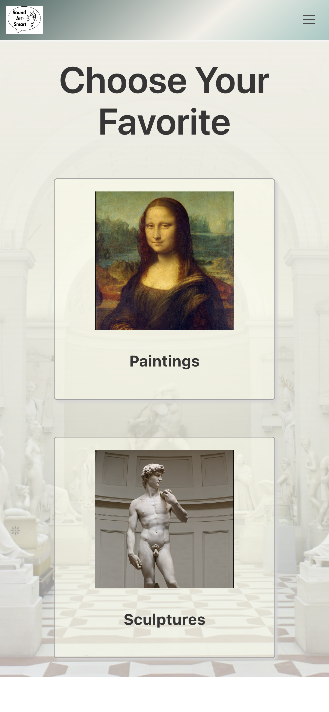
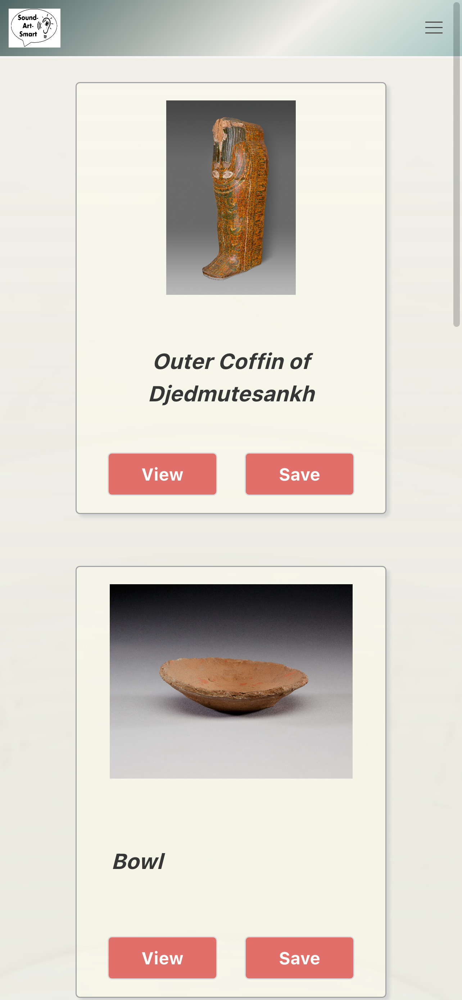
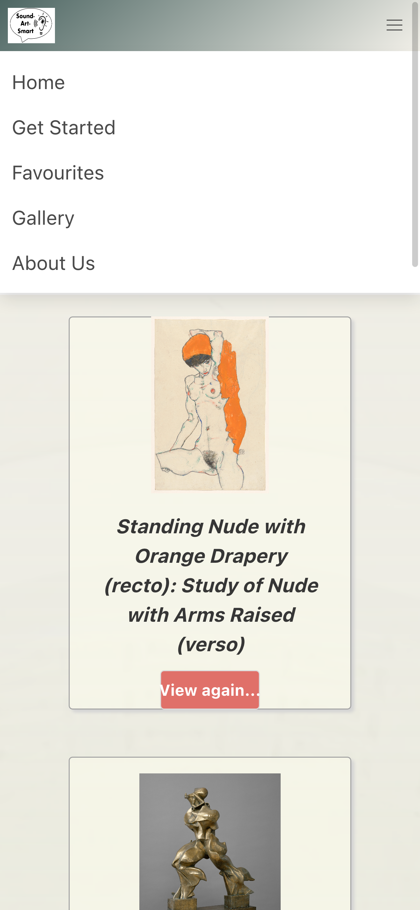

# Sound Art Smart

## About the Application

A quick visual questionnaire to discover artworks based on your interests.

Sound Art Smart guides the user through a short series of image-based selections in order to present a random assortment of up to 6 artworks matching their specified interests. The user can then learn more by viewing the artwork information pages which include the work's title, artist, date, medium and much more. Should the user want to come back later, they can save their favourite artworks. As an added bonus, users can view their favourites in a styled gallery page--a one-of-a-kind exhibit all their own!

## Contributors

Chris: https://github.com/gingus55  
Jonny: https://github.com/jj77847  
Elizabeth: https://github.com/EllieK2  
Dahir: https://github.com/DMO17  
Kayle: https://github.com/kayleriegerpatton

## User Flow & Features

From the home page a user can view the quote of the day, read a brief introduction to the application's features, and click "Get Started" to begin the questionnaire. The user is guided through a series of image-based questions to narrow down their art preferences, for example paintings vs. sculptures.

Once the user has made their choices, they are presented a random selection of up to 6 artworks aligned with those interests. From there, the user can view more information about each artwork including artist, date, medium, and much more, and also save it to their favourites.

Finally, from any page the user can access an About Us page, the questionnaire, their favourites, and their personal gallery from the navigation bar.

## Built With

### Technologies

- CSS & Bulma CSS framework
- HTML
- Javascript & jQuery
- Google Fonts

### Web APIs

- [The Metropolitan Museum of Art Collection API](https://metmuseum.github.io/)
- [They Said So Quotes API](https://quotes.rest/)

## Deployed Application

[Deployed URL](https://gingus55.github.io/sound-art-smart/)

## Screenshots

### Desktop Viewport

#### Index page

#### Questionnaire sample page

#### Results page

#### Favourites page

<!-- #### Gallery page
 -->

### Mobile Viewport

#### Index page

#### Questionnaire sample page

#### Results page

#### Favourites page

<!-- #### Gallery page
 -->
